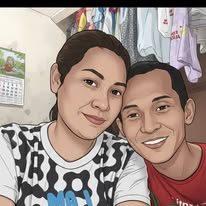
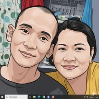

# Testing_browser
Para masubukan sa android phone na may maliit na screen at sa malaking screen gaya ng computer at iba pa
LINK NG AKING PAHINA  https://espedidorobin372-cmyk.github.io/Testing_browser/
Ito ay pagsasanay lang kaya makikita na iba iba ang laman ng Reposetory
            ito para subukan sa windows at mobile at sa ibang device na may ibat ibang laki ng screen,
            at iba pa, maraming salamat!
<!DOCTYPE html>
<html lang="tl-PH">
    <head>
    <meta charset="UTF-8">
    <meta name="viewport" content="width=device-width, initial-scale=1.0">
    <title>Pagsasanay Reposetory</title>
        <link rel="icon" href="robin.ico" type="image/x-icon">
    

    </head>
    <body>
        <pre>
            Ito ay pagsasanay lang kaya makikita na iba iba ang laman ng Reposetory
            ito para subukan sa windows at mobile at sa ibang device na may ibat ibang laki ng screen,
            at iba pa, maraming salamat!
        </pre>
        
<!--        <h2>TORTA</h2>
    

      
    <a href="larawan_ng_tinapay_menu.html" class="balik">⬅ BALIK SA LISTAHAN</a>
     
    <a href="timpla_tinapay2.html" class="balik">🏠 BALIK SA PANGUNAHING MENU</a>   --> 

    <!--============================================================================-->
    

    <h1>🥯 Menu ng Tinapay</h1>
    <button onclick="buksan('tinapayA')">Tinapay A</button>
  

  

    <h2>Tinapay A</h2>
    <button onclick="buksan('menu')">⬅️ Balik sa Menu</button>
    <button onclick="buksan('tinapayA_sangkap')">📋 Mga Sangkap</button>
  

  

    <h2>Sangkap ng Tinapay A</h2>
    <button onclick="buksan('tinapayA')">⬅️ Balik sa Tinapay</button>
    <button onclick="buksan('menu')">🏠 Diretso sa Menu</button>
  

  <!--=================================================================================-->
  
    </body>
</html>

<!--============================================================-->
<!DOCTYPE html>
<html lang="tl">
<head>
    <meta charset="UTF-8">
    <meta name="viewport" content="width=device-width, initial-scale=1.0">
    <title>Mga Larawan — Aayon sa Screen</title>
    
</head>
<body>
    <h1>Ang Aking Koleksyon ng Larawan 📷</h1>
    

        

        

        

        

        

        

        

        

        

        

        

        

        

        

        

        

    

</body>
</html>
